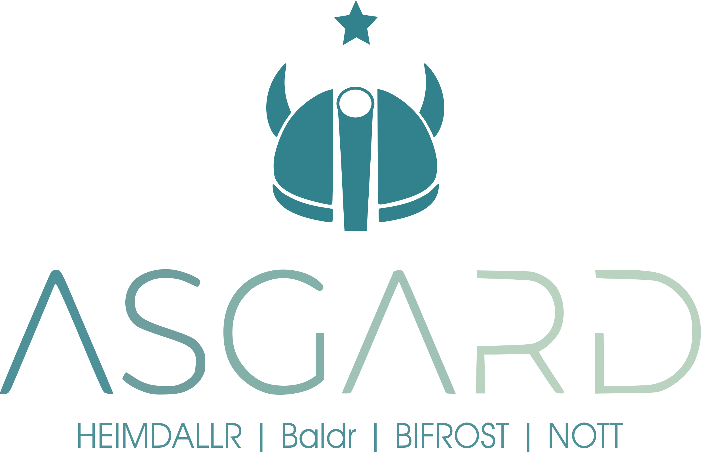

# Asgard
Official Asgard's codes repository.

Structure of the repo:

- The sub-repo ``designs`` contains some step files about the opto-mechanical design (may be out-dated);
- The sub-repo ``simulation`` contains codes and results of quick calculations for various things (refraction, throughput, dispersion...)
- The sub-repo ``software`` can contain sub-repos for the software of WAG and the instruments (baldr, bifrost, heimdallr, nott, solarstein)

# Acknowledgments
Asgard is funded by: 

- ERC Consolidator Grant "SCIFY", grant agreement CoG No. 866070)
- ERC Consolidator Grant "GAIA-BIFROST", grant agreement No. 101003096
- The ARC grant "The milli-arcsecond cosmos: astrophysical imaging with Heimdallr" No. LE220100126
- The European Union's Horizon 2020 research and innovation program under grant agreement No. 101004719
